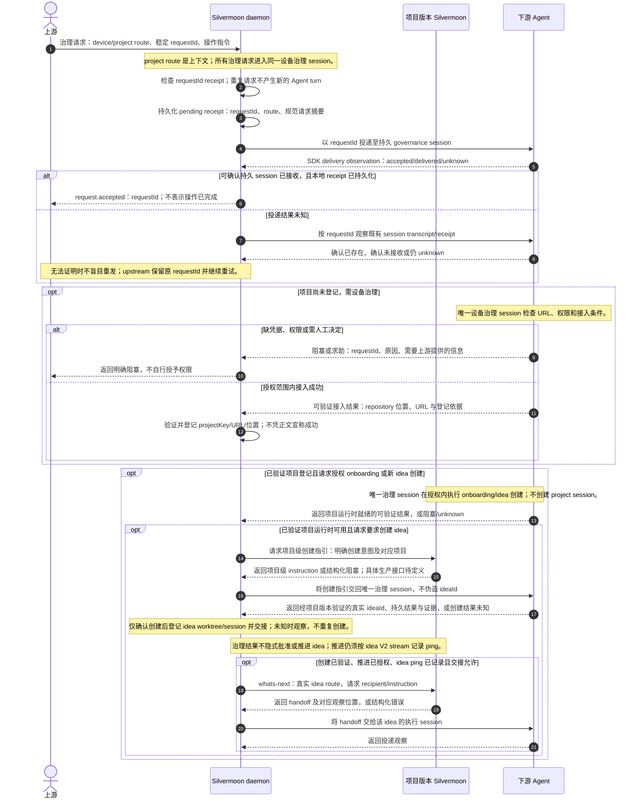

# daemon 与项目运行时交互时序

本图描述 daemon 的目标编排方式，不代表设备级 daemon 已实现。图中只保留四个
进程级主体：上游、daemon、项目版本 Silvermoon、下游 Agent。项目注册、worktree
解析、运行时适配器和网络中继均视为各自进程内部的实现细节。

本图的上游路由为 `{ scope: "idea", projectUrl, ideaId }`；
worktree 是 daemon 在本机解析出的执行
位置，不作为上游路由标识。daemon 永远主动连接上游服务；本地测试时由独立
CLI 启动 loopback upstream server，daemon 连接它，使用与远端相同的协议。
本图聚焦已有 idea 的交互；设备控制项目、项目存储与 URL 迁移见
[Project-storage.md](./Project-storage.md)。

图中的输入消息用于更新观察，所有面向上下游的工作 instruction 都由 Silvermoon
根据当前观察生成，再由 daemon 投递；不是逐条转发输入或回复。跨治理范围的
交接表示生成后续动作并保存其依据，不表示原 ping 沿 session 链传递。

以下操作名是生产协议的设计名称，不是已实现的 CLI 命令。daemon 可缓存初始化
观察、追加回执和增量事件中的 HEAD，但每个输入仍携带上游所依据的前态，并由
权威流原子校验。首次启动、失去观察或重连时通过生产 projection/cursor 接口恢复，
不能以调试 replay 替代。`requestId`、事件身份及映射的持久化方案仍需实施阶段确定。
项目事件 HEAD 为 V2 `events/` folder 的准确逻辑长度与完整 folder digest；
只有 idea event stream 使用 folder HEAD；它继承所属 project repository 的 Git
object format。治理 session 由 Agent SDK 持久化，不设治理流 HEAD。sequence 是事件位置，
不是 HEAD。上游附带的 expectedHead 是前态约束，stale 时不得被 daemon 替换。

```mermaid
sequenceDiagram
    autonumber
    actor Upstream as 上游
    participant Daemon as Silvermoon daemon
    participant Silvermoon as 项目版本 Silvermoon
    participant Downstream as 下游 Agent

    Upstream->>Daemon: 投递 ping：idea route、expectedHead(length,digest)、message、requestId
    Daemon-->>Upstream: 返回接收状态：已收件，或认证/路由/格式错误
    Note over Upstream,Daemon: 已收件仅表示 daemon 收到请求，尚未表示项目日志已追加。

    Note over Daemon,Silvermoon: 不预先查询或调用 event replay；追加原子校验上游给出的准确 folder 前态。
    Daemon->>Silvermoon: appendExpectedHead：route、expectedLength、expectedFolderDigest、ping(message)
    Silvermoon-->>Daemon: appended(sequence、new length/digest、cursor)、exact idempotent，或 stale(current length/digest)

    alt appended 或 idempotent（准确身份对应的事件已存在）
        Daemon-->>Upstream: 返回 request.accepted：requestId、route、durablePosition、是否重复请求
        Note over Upstream,Daemon: 这是“已持久记录”确认，不是下游送达或处理确认。
    else stale（准确前态已变化且没有相同规范事件）
        Daemon-->>Upstream: 返回 stale：route、提交所依据的旧 HEAD、当前 HEAD；本次输入不生成下游 instruction
        Note over Upstream,Daemon: 由上游重新观察并决定是否形成新输入；daemon 不换新 HEAD 重试。既有工作继续。
    else conflict 或项目不可用/输入错误
        Daemon-->>Upstream: 返回明确错误类别与原因；停止此次指令的自动派发
    end

    Note over Daemon,Silvermoon: 下列调度只在事件已确认记录且投递状态允许时继续；失败或未知不穿透为成功。
    Daemon->>Silvermoon: 调用 whats-next：route；请求机器可读 handoff 和对应观察位置
    Silvermoon-->>Daemon: 返回 recipient（upstream/downstream）、instruction、对应 head/cursor，或结构化错误
    Note over Daemon,Silvermoon: Silvermoon 决定 recipient 和 instruction；daemon 不读 status object、不解析自然语言 nextSteps。

    alt recipient = downstream
        Daemon->>Downstream: 投递 instruction：针对 route 的执行指令
        Downstream-->>Daemon: 返回投递观察：queued/delivered/processed/unknown；附实际边界或未知原因
        Note over Daemon,Downstream: SDK 接收回执不自动等于 processed；unknown 不授权盲目重发。
        Downstream-->>Daemon: 持续返回 session 状态、过程消息、工具活动及正式回复事件
        Note over Daemon,Downstream: 过程消息和工具活动仅用于观察；正式回复才可能成为 pong，完整执行日志仍归 Agent。
    else recipient = upstream
        Daemon-->>Upstream: 投递 instruction：上游需要执行的下一步或需处理的交还
        Upstream-->>Daemon: 返回处理结果或新 ping：projectUrl、ideaId、message、requestId
    end

    opt 下游产生正式回复或求助，需要交还上游
        Daemon->>Silvermoon: 调用 appendExpectedHead：route、回复依据的准确 folder HEAD、pong 正文
        Silvermoon-->>Daemon: 返回 appended/exact idempotent 或 stale；成功回执带 eventSequence、新 folder HEAD/cursor
        alt pong 已成功追加或确认幂等存在
            Daemon->>Silvermoon: 再调用 whats-next：基于刚追加的 pong 重新判断接收方和指令
            Silvermoon-->>Daemon: 返回 recipient、instruction、head/cursor
            alt recipient = upstream
                Daemon-->>Upstream: 投递 handoff：route、事件位置、instruction
            else recipient = downstream
                Daemon->>Downstream: 按投递状态向同一 session 传递 instruction
                Downstream-->>Daemon: 返回投递观察或明确 unknown
            end
        else stale（例如期间出现新 ping）
            Daemon-->>Upstream: 返回 stale 与当前 folder HEAD；不替换前态、不扩大旧 pong 的回复范围
        else conflict 或错误
            Daemon-->>Upstream: 显式交还：route、回复身份及冲突/错误原因
        end
    end

    opt 同一 idea 正在执行时又收到新的 ping
        Upstream->>Daemon: 投递新 ping：idea route、expectedHead(length,digest)、message、requestId
        Daemon->>Silvermoon: 原子 appendExpectedHead：使用输入携带的准确前态
        Silvermoon-->>Daemon: 返回 appended/exact idempotent 或 stale 与当前 HEAD
        alt 输入成功记录或确认完全相同事件已存在
            Daemon-->>Upstream: 返回持久接收确认与新 HEAD
            Daemon->>Silvermoon: 调用 whats-next：重新取得当前 recipient 与 instruction
            Silvermoon-->>Daemon: 返回 recipient 与 instruction
            Daemon->>Downstream: 若 recipient 为 downstream，向同一 session 投递生成的新 instruction
            Downstream-->>Daemon: 返回投递观察；不保证已立即处理
        else stale
            Daemon-->>Upstream: 拒绝这次输入，不因其触发新 instruction；此前执行继续
        end
        Note over Daemon,Downstream: 不等待旧 pong，不为同一 idea 隐式启动并行执行者。
    end

    opt daemon 或上游连接重启后恢复
        Daemon->>Silvermoon: 调用 production observe：route；请求当前权威 projection/HEAD 与准确 cursor
        Silvermoon-->>Daemon: 返回当前 projection/head、snapshot cursor，或明确不可用结果
        Daemon->>Silvermoon: 调用生产 readSince/subscribe：route、持久消费 prefix length/folder digest
        Silvermoon-->>Daemon: 返回增量事件、每条事件位置及后续 cursor，或 cursor 失效/缺口错误
        Note over Daemon,Silvermoon: 对齐 snapshot 与增量边界；不得以 event replay CLI 子进程实现生产查询。缺口显式协调。
        Daemon->>Downstream: 查询原 session 与执行状态；携带 projectUrl、ideaId 及已绑定 session 身份
        Downstream-->>Daemon: 返回 running/idle/gone/unknown 与实际可确认的投递事实；不保证缺失回复可重放
        alt 当前观察完整且指令投递/执行状态可确认
            Daemon->>Silvermoon: 调用 whats-next：请求恢复后的 recipient 与 instruction
            Silvermoon-->>Daemon: 返回 recipient 与 instruction
            alt recipient = upstream
                Daemon->>Upstream: 投递 instruction 与最新事件位置
                Upstream-->>Daemon: 返回处理结果或新的 ping
            else recipient = downstream
                Daemon->>Downstream: 向已确认的同一 session 投递 instruction
                Downstream-->>Daemon: 返回投递观察与后续活动
            end
            Note over Daemon,Downstream: 只投递确认未投递的新工作；已投递指令不因恢复而重发，session idle 也不证明安全重试。
        else 投递或副作用结果为 unknown
            Daemon-->>Upstream: 报告不确定状态、route 和已知事件位置，请求上游处理
            Note over Daemon,Upstream: 不创建替代 session，不自动重发可能已执行的指令。
        end

        opt append 或 Agent 发送后连接丢失，结果不确定
            Daemon->>Silvermoon: observeCurrent 并 eventsSince：route、稳定事件身份、已持久 cursor
            Silvermoon-->>Daemon: 返回当前 projection/head 与增量事实，或观察缺口/错误
            Daemon->>Downstream: 查询真实 session/执行状态及可确认的发送事实
            Downstream-->>Daemon: 返回实际可确认状态，或 unknown(reason)
            Note over Daemon,Downstream: 先确认事件和投递结果；不得把 unknown 当作未发送，也不得重放副作用。
            Daemon-->>Upstream: 返回已确认结果，或携带请求身份和已知位置的不确定性报告
        end
    end
```

## 单一设备治理 session 与 idea 交接

设备控制项目 `$HOME/.silvermoon/device-hq/` 的唯一治理 session 由 Agent SDK
持久化。设备
治理、managed project 操作和 idea 推进不创建多个 project-level governance
session；`project` route 只是这一个治理 session 的操作上下文。只有 idea 有
Silvermoon lifecycle event stream。

这张图表达职责交接，不确定治理操作结果的具体事件编码。登记权限、引导指令、
创建与交接的机器接口仍需细化。治理 session 和 requestId receipt 边界见
[Governance-sessions.md](./Governance-sessions.md)。
治理 session 接收确认不替代 idea 流确认；upstream 对未确认输入按同一 requestId
保留并重投。idea expectedHead 是提交前态约束；stale 一律交还上游，不由 daemon
自动更新后重试。

## 前置能力与本图边界

- [project-agent-runtime](../../../../01M3SK3CGZF47A36D2GWN8BFPC/outer/inner/Implementation.md)
  已提供项目版本隔离、准确前态交互追加，以及按 `projectUrl + ideaId` 定位项目
  和 worktree 的注册表。既有 `ProjectRuntime.replay` 是前置实现的接口，不是
  本图认可的 daemon 生产接口；生产整合须补足权威 projection/head、增量 cursor
  与结构化冲突协调能力。图中的操作名和新回执字段都是目标协议，并非已交付能力。
- 同一前置 idea 已提供 `AgentAdapter.start/observe/send/events`。投递观察区分
  `queued`、`delivered`、`processed` 和 `unknown`，但只有 SDK 明确证据才可报告；
  `unknown` 不会授权适配器暗中重试。
- [local-agent-handoff](../../../../01M3SJXTDXW54FFCSKSBJMMRBZ/outer/inner/Implementation.md)
  定义 `ping/pong` 为项目交互事件；日志顺序决定消息身份和交互方向。`pong`
  不是与某条 `ping` 配对的网络确认，旧前态追加会因并发新事件而失败。
- `whats-next` 目前返回完整结构化报告；本 idea 要求其面向 daemon 的 handoff
  包含机器可读 `recipient` 和 `instruction`。具体 instruction 生成规则仍待
  后续按场景细化。
- 前置实现没有为上游 `requestId` 提供跨 daemon 重启的持久幂等账本，也没有
  把 Agent 投递状态写成项目事件的接口。若 daemon 需要请求去重或投递恢复记录，
  必须在不制造第二份项目权威状态的前提下，定义本机运行元数据及其恢复边界。
- 本图的上游连接传输、独立 loopback upstream server、远端中继与应用层 wire protocol 是本 idea
  的设计范围，不是前置任务已经实现或验证的能力。
- 正常追加原子校验输入携带的 folder HEAD；stale 交还上游，不以刷新后的 HEAD
  重试原输入。初始化、cursor 缺口及发送不确定另有生产观察路径，不属于每次正常
  追加前的查询。事件等价性不能由正文相同推断，旧输入也不能由 daemon 猜测仍适用。
- `event replay` 的开发、历史验证、受控人工恢复和内部 reducer/projector
  使用边界见 [Replay-boundary.md](./Replay-boundary.md)。daemon 生产路径不调用
  它，Silvermoon 内部不通过 CLI 子进程调用自己。
