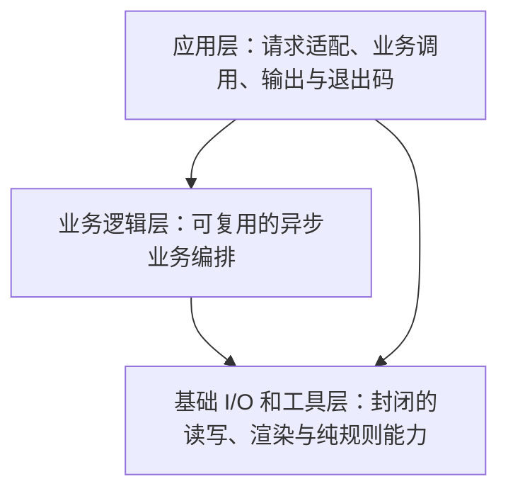

# Source modules

## 三层目标架构

**本页是下一轮重构的目标设计，不是当前源码依赖图。** 现有顶层存在逻辑环，须归位职责，不能只改名／连线。

只有三层：应用层、业务逻辑层、基础 I/O 和工具层。依赖自顶向下，无逆向，
允许跨级。纯函数是一种函数属性，不是第四层；Text/TUI 是基础输出能力。



目标物理结构：

```text
bin/                         # 应用层；每个可启动入口一个文件
src/
├── business/                # 业务层；每个业务入口函数一个文件
│   └── shared/              # 每个共享业务函数一个文件
└── foundation/              # 基础层；每个模块一个目录
    └── <module>/
        ├── README.md
        ├── index.ts
        └── <implementation>.ts
```

## 1. 应用层按进程入口划分

这里的“消息”是进程边界的输入／输出契约，不是新增 schema 或进程间消息总线。
目标应用层整体位于 `bin/`。每一行只表示一个可独立启动的进程入口，目标入口
本身包含参数适配、业务调用、结果输出和退出码，不再保留另一个 launcher 或
同入口 application implementation。可复用 helper 下沉业务层或基础层，不列为应用。

| 目标入口文件 | 当前入口 | 接收的消息 | 发出的消息 | 说明 |
| --- | --- | --- | --- | --- |
| `bin/silvermoon.ts` | [bin/silvermoon.ts](../bin/silvermoon.ts) | 命令、argv、可选 JSON 输入文件、stdin、TTY／locale／trace 事实 | `CommandReport` 的 JSON、Text 或 TUI 表示，migration JSON 回执、诊断／trace 和命令专属退出码 | 唯一用户 CLI；包含通用 `migrate` 子命令，其他子命令不拆成应用 |
| `bin/link-personal-skill.ts` | [bin/link-personal-skill.ts](../bin/link-personal-skill.ts) | 已安装 package 的 canonical skill 和个人 home 路径 | 已创建／已存在的 personal skill link 或明确失败诊断 | 已安装 runtime 的 `silvermoon-link-skill`；不覆盖修改过或指向其他目标的 registration |
| `bin/migrate-v1-to-v2.ts` | [bin/migrate-v1-to-v2.ts](../bin/migrate-v1-to-v2.ts) | capability graph 中的 `project-v1-to-v2`、project root、plan／apply／resume／rollback、plan digest、writer 停止确认 | V1 到 V2 的 JSON 计划或执行／恢复回执；失败写 stderr 和非零退出码 | 版本专用 compatibility alias；新调用统一走 `silvermoon migrate` |
| `bin/run-checks.ts` | [bin/run-checks.ts](../bin/run-checks.ts) | 无参数或 `sanity`／`commit`／`release` tier | 逐 gate 开始、结果、耗时、汇总和退出码 | 组合检查，不修改候选 |
| `bin/pure-check.ts` | [bin/pure-check.ts](../bin/pure-check.ts) | `src` TypeScript 和纯规则入口 | 纯函数数量、违规位置／原因和退出码 | 静态纯度检查 |
| `bin/check-pack.ts` | [bin/check-pack.ts](../bin/check-pack.ts) | package manifest、白名单和 `npm pack` 结果 | 包内容／入口诊断和退出码 | 检查制品，不发布 |
| `bin/ci-package-risk.ts` | [bin/ci-package-risk.ts](../bin/ci-package-risk.ts) | base／head revision 或 full 模式 | 风险分类、受影响路径和退出码 | 只为 CI 选择 gate |
| `bin/generate-npm-readme.ts` | [bin/generate-npm-readme.ts](../bin/generate-npm-readme.ts) | commit、可选 source 和 output path | 固定 commit 链接的 README 或失败诊断 | 只生成制品文档 |
| `bin/prepare-npm-release.ts` | [bin/prepare-npm-release.ts](../bin/prepare-npm-release.ts) | release tag，或 canary channel、run number 和准确 primary commit | release key、稳定版或派生 canary 版本、dist-tag 和 workflow 输出 | 不执行发布 |
| `bin/stage-npm-canary.ts` | [bin/stage-npm-canary.ts](../bin/stage-npm-canary.ts) | 隔离 package directory 和 planner 产生的 canary 版本 | 只改 staging manifest 的 canary package | 拒绝跨稳定版本线或非规范 canary |
| `bin/build-npm-tarball.ts` | [bin/build-npm-tarball.ts](../bin/build-npm-tarball.ts) | package directory、output directory、Git HEAD | tarball 路径、hash、integrity 和打包元数据 | 构建可验证制品 |
| `bin/verify-npm-release.ts` | [bin/verify-npm-release.ts](../bin/verify-npm-release.ts) | package、版本、dist-tag、commit、source ref 和 tarball | registry、provenance、source ref 与 tarball 一致性 | 发布后只读验证 |

事件历史修订和中断恢复不设进程入口，也不属于应用层。维护者直接编辑 idea 的
`events.jsonl`，再通过普通 Git review 和 snapshot／event history 校验确认完整
文件。CLI 正常事件能力只保留 replay 和 append；目标实现应移除 revise／recover
命令及其专用业务编排，而不是把它们迁移成脚本。

应用入口把 argv、文件、stdin、终端和环境事实适配成业务函数参数，再把业务结果
适配成 stdout、stderr、交互界面和退出码。业务层不解析 argv，也不选择展示方式。
外部 v1→v2 迁移的 apply 绑定只读计划的准确 digest；其 resume／rollback 不构成
通用事件维护能力。已完成的本仓库内部事件格式迁移不再保留入口或实现。制品准备
与验证不发布 npm，检查成功也不构成生命周期决定。

Agent 适配库／包子路径和公共 export 不是进程入口，不单列应用；默认依赖组装归
各入口，index 仍只做 export。应用可跨级调用基础能力；可复用流程放业务层，
脚本专用流程留脚本，不把所有脚本代码塞进基础层。

## 2. 业务逻辑层的重点函数

以下是职责与内部命名候选，不新增公开命令，也不改变既有公共 API 签名。
业务函数主要返回 Promise，负责基础能力的调用顺序、分支、事实组合与错误传播。
返回类型也是设计名称，不是新增声明或 schema。`Promise<T>` 表示副作用完成后得到 T，
不是 Text/TUI，也不表示写入已同步 primary。纯规划／报告组装不必包装为 Promise。

业务层整体位于 `src/business/`。每个顶层业务入口函数独占一个同名 kebab-case
文件；该文件可以有私有 helper，但只公开一个业务入口，不以 barrel 合并实现。
共享业务函数位于 `src/business/shared/`，同样每个函数一个文件；共享的判断标准
是至少两个业务入口直接依赖它，不因“以后可能复用”提前放入 shared。

| 函数 | 返回类型 | 功能与输出内容 |
| --- | --- | --- |
| `listIdeas` | `Promise<CommandReport>` | 本地查询、按需读标题；返回清单、规范查询与统计，不要求导航 hygiene，不 fetch |
| `whatsNext` | `Promise<CommandReport>` | 本地检查后 fetch 和路由；返回选中 idea、准确世界版本、guidance 或阻塞／选择信息 |
| `createIdea` | `Promise<CommandReport>` | 本地验证、规划与保护写入；返回创建身份／路径或失败与清理结果，任意正确跟踪 primary 的分支均可，不 fetch |
| `checkRepository` | `Promise<CommandReport>` | 编排指定快照校验；返回目标、有效性、诊断及历史证据，仅 remote 路径 fetch |
| `readEvents` | `Promise<CommandReport>` | 无游标返回 `EventReplayReceipt`（完整坐标、格式／归约及未 fetch 的本地 baseline）；有准确游标返回 `EventDeltaReceipt`（原游标、后缀与新坐标），不含完整归约、不重置失效游标或退化为全量扫描 |
| `appendEvent` | `Promise<CommandReport>` | 离线交互或状态写入；返回 `EventWriteReceipt`：写入 outcome、是否写入、流坐标和适用 primary／历史证据 |

`CommandReport` 保留 `intention`、`observation`、`actions`、`response` 四投影；
事件 receipt 置于既有报告中，不替代报告。受阻、无效和可恢复失败显式携带诊断，
未映射的异常 reject；不以空数据、成功回执或统一退出码掩盖错误。
正常事件业务只保留读取与追加。历史修订和中断恢复由维护者直接编辑
`events.jsonl`，并由 Git review 与校验发现无效候选；业务层不提供
revise／recover 编排。

共享业务函数不属于某个命令，顶层业务之间不互相调用：

| 共享函数 | 返回类型 | 功能与类型含义 |
| --- | --- | --- |
| `observeDevice` | `Promise<ObservedDevice>` | 设备事实集合：当前运行来源、全局 Silvermoon 安装是否存在，以及全局配置是否存在、可读且有效；不读取项目，不观察 daemon |
| `observeProject` | `Promise<ObservedProject>` | 显式消费 device facts，观察项目配置、布局、诊断、内容／输出语言、readiness 与准确 snapshot 来源；不读取具体 idea |
| `observeIdea` | `Promise<ObservedIdea>` | 显式消费 project facts，观察选中 idea 的身份、状态、世界版本、内容语言、路径、诊断与来源；不重复观察 device/project，不推断选择或批准 |
| `assessCreationReadiness` | `Promise<CreationReadiness>` | ready／blocked 结果及本地分支、HEAD、变更和阻塞原因；不 fetch 或比较 primary ancestry |
| `assessNavigationReadiness` | `Promise<NavigationReadiness>` | 本地结果加刷新 primary、提交关系与历史证据；不自动 merge、push 或改变分支 |

观察严格分三层：device → project → idea。下层结果作为显式输入传给上一层，不通过
全局 Context 隐式重读，也不把三层折叠成一次全仓观察。当前 `observeDevice` 只验证
全局安装与全局配置的存在性、可读性和格式；缺少全局安装在源码 checkout 等合法
运行来源下可以是事实而非自动错误。daemon 进程、socket、版本握手、健康和会话
状态不在本轮范围；daemon 模式形成独立契约后再扩展 `ObservedDevice`。

## 3. 基础层按封闭领域分哪些子模块

基础模块可以理解 Silvermoon 的元数据和协议，但不编排完整用户意图，也不回调
业务／应用入口。下表名称是目标英文模块／目录名；“当前边界”只说明迁移来源，
不是继续保留大模块的理由。每个模块独占 `src/foundation/<module>/`，只有一个
变化原因和一个 export-only `index.ts` 公开入口。

| 目标模块 | 当前边界 | 单一职责与能力边界 | 明确不承担 |
| --- | --- | --- | --- |
| `git` | `repository` | 执行 Git、读取 refs／objects、显式 fetch 和提交关系 | snapshot 选择、业务 readiness、隐式联网 |
| `snapshot` | `repository` | 表达 worktree／index／commit／remote snapshot，批量读取不可变内容 | fetch、生命周期判断、写入 |
| `installation` | 新模块 | 识别当前运行来源并观察全局 Silvermoon executable／version 是否存在 | 安装或升级、daemon 探测、项目判断 |
| `device-config` | `project/user-config` | 定位、读取并严格解析全局 Silvermoon 配置 | 项目配置、写配置、daemon 状态 |
| `project-config` | `project` | 读取并严格解析一个项目配置及其来源 | adoption、guidance、用户偏好 |
| `guidance` | `project` | 读取固定 phase guidance 及 content revision | 执行 Markdown、决定下一步 |
| `skill-registration` | `project` | 检查 canonical／registered skill 来源和一致性 | 安装依赖、同步文件、项目 adoption |
| `package-resource` | `project` | 定位并读取随包发布的 schema、模板和静态资源 | 解析业务内容、访问项目 worktree |
| `schema` | `project` | 按版本验证结构化数据字段和类型 | YAML 解析、业务 readiness、自动修复 |
| `idea-model` | `idea` | idea 身份、状态、世界 revision 和生命周期纯规则 | inventory 查询、事件存储、I/O |
| `idea-query` | `idea` | 对显式 idea facts 执行过滤、排序、限制和标题投影 | 读取目录、默认联网、生命周期变更 |
| `idea-template` | `idea` | 从显式语言／版本事实生成规范世界文档内容 | 生成 ID／时间、写文件 |
| `scaffold-plan` | `idea` | 将显式 ID、时间、语言和模板组成 `ScaffoldPlan` | 默认值获取、所有权写入 |
| `event-codec` | `events` | 解析、验证和序列化规范事件记录与完整日志字节 | reduce、Git 历史、写入授权 |
| `event-reducer` | `events` | 将已验证事件归约为状态和协议错误 | 读取 storage、缓存、修复历史 |
| `event-store` | `events` | 按 1000 条边界读取／规划分段文件和准确字节 | 解释 payload、fetch、完整命令编排 |
| `event-history` | `events` | 验证 primary prefix、folder Git digest 和历史边界 | 修改历史、决定人工授权 |
| `event-cursor` | `events` | 验证准确前缀并规划只含 suffix 的增量结果 | 自动重置游标、退化为全量 replay |
| `projection-cache` | `events`／`repository` | 认证、读取和更新可丢弃的派生投影缓存 | 成为事实权威、掩盖 source 错误 |
| `owned-write` | `repository` | 独占创建脚手架并仅清理仍属本次操作的内容 | 状态事件追加、通用文件写入 |
| `state-transaction` | `repository` | 锁内复查并原子应用正常状态追加的准确 before／after 字节 | revise／recover 入口、业务授权、静默重试 |
| `command-message` | `command` | reduce 单次调用消息、检查 action 配对和顺序不变量 | 持久 idea 事件、trace 发布、报告渲染 |
| `report` | `response` | 从显式终态投影四投影、诊断和本地化 next steps | 重判 readiness、执行 action、输出终端 |
| `renderer` | `presentation` | 从显式报告和时间纯渲染 JSON／Text／Markdown、表格与日期 | 读取时钟、业务推导、终端 I/O |
| `terminal` | `presentation` | 适配 stdout／stderr、TTY 能力和 clipboard | 文本内容决策、TUI 状态、仓库 I/O |
| `tui` | `presentation/tui` | 惰性启动交互界面并返回明确用户选择 | 被父入口 eager load、业务状态推导 |
| `language` | `project`／`presentation` | 规范化内容语言、输出语言和 locale 基础值 | 读取项目、选择 command 行为 |
| `coordinates` | 多个模块 | 校验 repository URL、OID、ULID 和规范相对路径值 | I/O、业务组合、万能 utils |
| `trace` | `command/trace` | 发布结构化 trace 和显式计时事实 | 命令状态存储、日志式业务控制 |
| `process` | `repository` | 受控执行子进程并返回 stdout／stderr／exit facts | Git 语义、trace 策略、错误吞并 |

每个基础模块目录必须同时包含代码和 `README.md`。README 说明模块职责、能力边界、
允许依赖、明确不承担的职责，并逐项解释 `index.ts` 输出的关键函数用途。新增、
删除或改变关键 export 时，代码、README 和依赖测试必须在同一候选中同步更新。

同属基础层不代表互相任意依赖。例如事件规则依赖 idea 的身份／状态规则，
idea 不反依赖事件；`snapshot` 依赖 `git`，`git` 不认识 snapshot；`event-history`
可依赖 `git` 与 `event-codec`，两者不反向依赖；`renderer` 依赖 `language`，
language 不认识报告。必要组合上移业务层，不建设万能 utils 模块。

## 组织与验证约定

每个目录保留职责 README 和 export-only index；同目录引用具体 sibling 文件，
跨模块通过公开入口，纯工具不经入口加载 I/O。后续检查应验证三层依赖方向和
模块图无环，不仅检查文件图无环。`@pure` 检查、行为、增量预算和异常历史校验继续保留。

当前目录导航：[business](./business/README.md)、
[business shared](./business/shared/README.md) 和 [foundation modules](./foundation/)。
[包入口](./index.ts)和 Agent 独立子路径保持兼容。
维护约定见 [maintaining](../docs/maintaining.md)。
