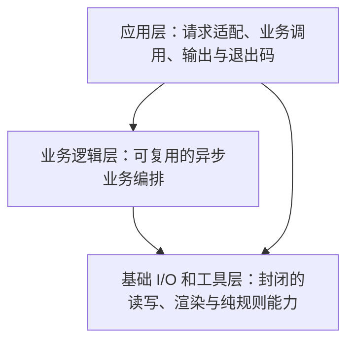

# Source modules

## 三层目标架构

**本页是下一轮重构的目标设计，不是当前源码依赖图。** 现有顶层存在逻辑环，须归位职责，不能只改名／连线。

只有三层：应用层、业务逻辑层、基础 I/O 和工具层。依赖自顶向下，无逆向，
允许跨级。纯函数是一种函数属性，不是第四层；Text/TUI 是基础输出能力。

## 1. 应用层按进程入口划分

| 模块 | 主要职责 |
| --- | --- |
| CLI 主应用 | 唯一主应用，入口为 [bin/silvermoon.js](../bin/silvermoon.js)；解析命令、参数和输入，调用业务函数，选择 JSON/Text/TUI，发布输出并映射退出码；CLI 子命令不是独立应用 |
| 一次性迁移脚本 | 每个可独立启动的迁移入口是一个脚本应用，文件统一放在 [scripts](../scripts/)；处理参数、显式授权与结果输出，调用业务／基础能力，不进入 src 的运行时业务清单或公共 API |
| 事件维护脚本 | 文件放在 [scripts](../scripts/)；负责已审核 owned suffix／明确归约失败历史的修订，以及中断事务恢复／回滚。允许人工编辑候选，但须校验准确流、primary、授权与候选后受保护写入；恢复另须确认 writer 停止并复查计划、字节及适用世界版本，不直接手改权威流或按锁年龄夺取所有权 |
| 辅助工具脚本 | 按独立进程入口组织检查、技能同步、打包验证等工具，文件放在 [scripts](../scripts/)；各自处理输入、调用能力、输出结果与退出码，库 helper 不算独立应用 |

Agent 适配库／包子路径和公共 export 不是进程入口，不单列应用；默认依赖组装归各入口，index 仍只做 export。
业务层不解析参数或选择 UI／退出码。应用可跨级调用基础能力；可复用流程放业务层，脚本专用流程留脚本，不把所有脚本代码塞进基础层。

## 2. 业务逻辑层的重点函数

以下是职责与内部命名候选，不新增公开命令，也不改变既有公共 API 签名。
业务函数主要返回 Promise，负责基础能力的调用顺序、分支、事实组合与错误传播。
返回类型也是设计名称，不是新增声明或 schema。`Promise<T>` 表示副作用完成后得到 T，
不是 Text/TUI，也不表示写入已同步 primary。纯规划／报告组装不必包装为 Promise。

| 函数 | 返回类型 | 功能与输出内容 |
| --- | --- | --- |
| `listIdeas` | `Promise<CommandReport>` | 本地查询、按需读标题；返回清单、规范查询与统计，不要求导航 hygiene，不 fetch |
| `whatsNext` | `Promise<CommandReport>` | 本地检查后 fetch 和路由；返回选中 idea、准确世界版本、guidance 或阻塞／选择信息 |
| `createIdea` | `Promise<CommandReport>` | 本地验证、规划与保护写入；返回创建身份／路径或失败与清理结果，任意正确跟踪 primary 的分支均可，不 fetch |
| `checkRepository` | `Promise<CommandReport>` | 编排指定快照校验；返回目标、有效性、诊断及历史证据，仅 remote 路径 fetch |
| `readEvents` | `Promise<CommandReport>` | 无游标返回 `EventReplayReceipt`（完整坐标、格式／归约及未 fetch 的本地 baseline）；有准确游标返回 `EventDeltaReceipt`（原游标、后缀与新坐标），不含完整归约、不重置失效游标或退化为全量扫描 |
| `appendEvent` | `Promise<CommandReport>` | 离线交互或状态写入；返回 `EventWriteReceipt`：写入 outcome、是否写入、流坐标和适用 primary／历史证据 |

`CommandReport` 保留 `intention`、`observation`、`actions`、`response` 四投影；
事件 receipt 置于既有报告中，不替代报告。受阻、无效和可恢复失败显式携带诊断，
未映射的异常 reject；不以空数据、成功回执或统一退出码掩盖错误。
正常事件业务只保留读取与追加。修订维护历史／候选，恢复处理中断事务，两者不同；
上述是目标归属，现有 revise/recover 命令未删除，公开接口调整须另行明确决定并验证兼容性。

共享业务函数不属于某个命令，顶层业务之间不互相调用：

| 共享函数 | 返回类型 | 功能与类型含义 |
| --- | --- | --- |
| `observeProject` | `Promise<ObservedProject>` | 项目事实集合：配置、布局、诊断、内容／输出语言、readiness 与准确 snapshot 来源；不只返回 config |
| `observeIdea` | `Promise<ObservedIdea>` | 选中 idea 的身份、状态、世界版本、内容语言、路径、诊断与来源；不推断选择或批准 |
| `assessCreationReadiness` | `Promise<CreationReadiness>` | ready／blocked 结果及本地分支、HEAD、变更和阻塞原因；不 fetch 或比较 primary ancestry |
| `assessNavigationReadiness` | `Promise<NavigationReadiness>` | 本地结果加刷新 primary、提交关系与历史证据；不自动 merge、push 或改变分支 |
| `validateEventCandidate` | `Promise<ValidatedEventCandidate>` | 准确候选坐标、布局、世界版本、历史及适用授权验证证据；不是持久授权，写入锁内仍须复查 |

## 3. 基础层按封闭领域分哪些子模块

基础模块可以理解 Silvermoon 的元数据和协议，但不编排完整用户意图，也不回调
业务／应用入口。下面的基础能力均不依赖上两层；模块间依赖也应单向、无环。

| 子模块 | 封闭能力与边界 |
| --- | --- |
| Git 与快照 | Git 命令、显式 fetch、提交关系、worktree/index/commit 快照和批量 blob 读取；普通读取不隐藏联网 |
| 项目元数据 I/O | 配置、用户偏好、idea 文件、skill、guidance 与包资源的基础读取；返回原始内容／诊断，不生成完整用户报告 |
| schema 与格式校验 | schema、严格 YAML、字段与规范字节校验；不判断整个命令是否应该继续 |
| idea 规则 | 身份／状态校验、生命周期计算、查询、标题提取、模板与显式 ID 编码；不认识创建流程或事件存储 |
| 脚手架生成 | 纯函数 `buildIdeaScaffold` 返回 `ScaffoldPlan`（目录、文件和规范字节计划）；ID、语言、格式由业务层显式提供，不读写、不获取时间／随机数、不自行选择格式 |
| 事件协议与存储 | 事件解析、序列化、reduce、分段读写计划、folder digest、游标前缀、认证派生缓存和修复校验；不 fetch primary 或决定完整写入流程，格式损坏／解析失败不自动授权改写历史 |
| 状态写入与事务 | 独占脚手架写入、所有权清理、状态路径保护、锁、持久备份、精确字节应用和恢复原语；两种写入保护保持独立 |
| 命令消息与报告工具 | 消息 reduce、不变量、action 配对、诊断与指令转换；纯函数 `projectCommandReport` 返回四投影 `CommandReport`，只转换显式终态和 action 事实，不重判 readiness／生命周期／授权，不执行 action、trace 或输出 |
| 输出与终端 | JSON/Text/Markdown、日期／表格、TTY/TUI 与 clipboard；显式接收结果，默认环境适配与纯渲染分开，TUI 惰性加载 |
| 语言与基础值 | 内容／输出语言、locale、repository 坐标、OID、路径和基础标识规则；不依赖项目 reader、命令或报告 |
| 观测与进程 I/O | trace、计时、显式消息 sink 与受控子进程执行；不依赖业务状态或命令生命周期 |

同属基础层不代表互相任意依赖。例如事件规则依赖 idea 的身份／状态规则，
idea 不反依赖事件；诊断／输出依赖语言工具，元数据读取不反依赖报告；Git 使用
观测能力，观测不认识 Git 业务。必要的组合上移业务层，不建设万能 utils 模块。

## 组织与验证约定

每个目录保留职责 README 和 export-only index；同目录引用具体 sibling 文件，
跨模块通过公开入口，纯工具不经入口加载 I/O。后续检查应验证三层依赖方向和
模块图无环，不仅检查文件图无环。`@pure` 检查、行为、增量预算和恢复测试继续保留。

当前目录导航：[cli](./cli/README.md)、[application](./application/README.md)、
[idea](./idea/README.md)、[command](./command/README.md)、[events](./events/README.md)、
[project](./project/README.md)、[repository](./repository/README.md)、
[response](./response/README.md)、[presentation](./presentation/README.md)、
[agents](./agents/README.md)。[包入口](./index.js)和 Agent 独立子路径保持兼容。
维护约定见 [maintaining](../docs/maintaining.md)。
